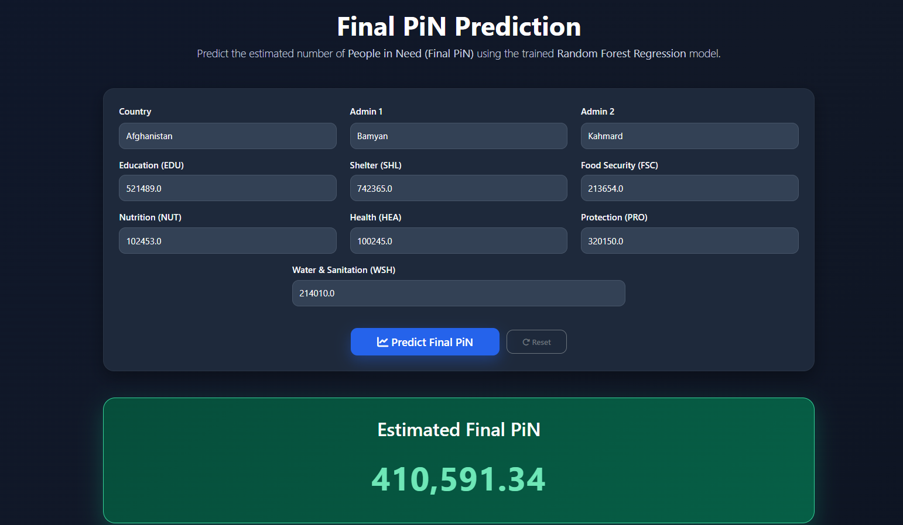
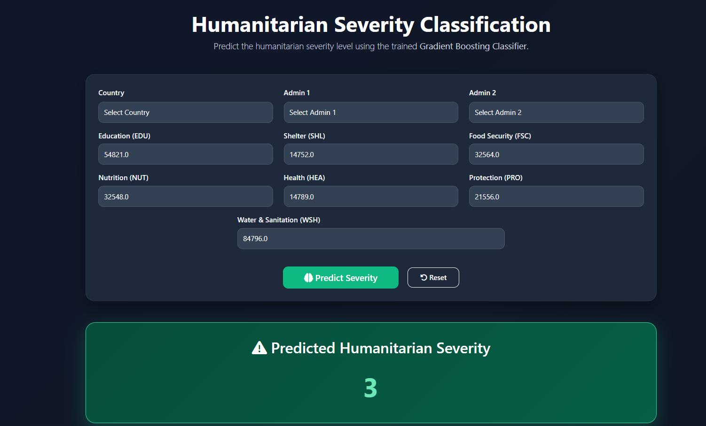
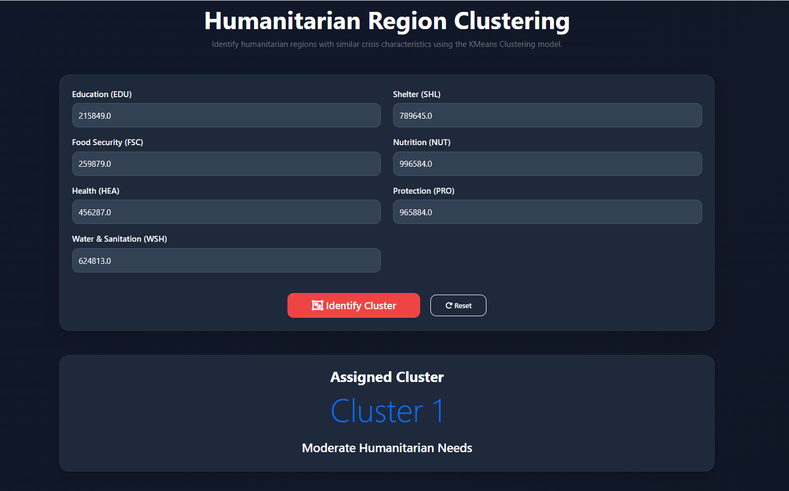

# 🌍 Humanitarian Aid Allocation System

> **AI-Powered Decision Support System for Humanitarian Resource Allocation**

An end-to-end Machine Learning web application that predicts **People in Need (Final PiN)**, classifies humanitarian crisis severity, and clusters regions with similar humanitarian conditions to support data-driven humanitarian decision-making.

---

## 📌 Project Overview

Humanitarian organizations often face challenges in allocating limited resources during emergencies. Manual assessment of humanitarian conditions can delay response efforts and reduce the efficiency of aid distribution.

The **Humanitarian Aid Allocation System** leverages Machine Learning to assist humanitarian organizations by providing predictive insights through an interactive Flask web application.

The application integrates three Machine Learning models to support humanitarian planning and resource prioritization.

---

# 🎯 Objectives

- Predict the estimated **People in Need (Final PiN)** using Regression.
- Classify humanitarian **Severity Levels** using Classification.
- Cluster regions with similar humanitarian conditions.
- Support data-driven humanitarian resource allocation.
- Provide an interactive web application for humanitarian decision support.

---

# ✨ Features

- 📈 Final PiN Prediction
- 🚨 Humanitarian Severity Classification
- 🌍 Region Clustering
- 📊 Interactive Dashboard
- 🌐 Flask Web Application
- 🎨 Responsive Bootstrap Interface
- 📍 Dynamic Country → Admin 1 → Admin 2 Selection
- ⚡ Real-time Predictions
- 🔄 Reset Functionality

---

# 📊 Dataset

### Source

- Humanitarian Data Exchange (HDX)
- Joint Intersectoral Analysis Framework (JIAF)

### Dataset Summary

- 🌍 6 Countries
- 📍 1700+ Administrative Regions
- 📑 Humanitarian Indicators

Features used:

- Education (EDU)
- Shelter (SHL)
- Food Security (FSC)
- Nutrition (NUT)
- Health (HEA)
- Protection (PRO)
- Water & Sanitation (WSH)

---

# 🤖 Machine Learning Models

## 1️⃣ Random Forest Regression

**Purpose**

Predict the estimated **People in Need (Final PiN)**.

---

## 2️⃣ Gradient Boosting Classification

**Purpose**

Predict Humanitarian Severity Level.

Severity Levels:

- Level 1 – Minimal
- Level 2 – Stressed
- Level 3 – Serious
- Level 4 – Critical
- Level 5 – Catastrophic

---

## 3️⃣ K-Means Clustering

**Purpose**

Group regions with similar humanitarian conditions.

Clusters:

- Cluster 0 – Lower Humanitarian Needs
- Cluster 1 – Moderate Humanitarian Needs
- Cluster 2 – High Humanitarian Needs

---

# 💻 Tech Stack

### Programming

- Python

### Machine Learning

- Scikit-learn
- Pandas
- NumPy

### Model Storage

- Joblib

### Deployment

- AWS (Deployment Ready)

---

# 📸 Application Screenshots

## 🏠 Landing Page

*(Add Screenshot)*

---

## 📈 Regression



---

## 🚨 Classification




---

## 🌍 Clustering



---

## 📊 Dashboard

*(Add Screenshot)*

---

# 📂 Project Resources

This repository includes all project deliverables.

| Resource | Description |
|----------|-------------|
| 📽 Project Presentation | 6-slide capstone presentation |
| 📊 Dataset | Humanitarian dataset from HDX & JIAF |
| 💻 Source Code | Complete Flask application and Machine Learning models |
| 📑 Documentation | README with project details |

---

# 📁 Project Structure

```text
Humanitarian-Aid-Allocation-System/
│
├── app.py
├── README.md
├── requirements.txt
│
├── Presentation/
│   └── Humanitarian_Aid_Allocation_System_Presentation.pptx
│
├── dataset/
│
├── models/
├── encoders/
├── features/
│
├── static/
│   ├── css/
│   ├── js/
│   ├── images/
│   └── data/
│
├── templates/
│
└── screenshots/
```

---

# ⚙️ Installation

### Clone Repository

```bash
git clone https://github.com/YOUR_USERNAME/Humanitarian-Aid-Allocation-System.git
```

### Navigate to Project

```bash
cd Humanitarian-Aid-Allocation-System
```

### Install Dependencies

```bash
pip install -r requirements.txt
```

### Run Application

```bash
python app.py
```

Open your browser:

```
http://127.0.0.1:5000
```

---

# 🚀 Future Scope

- Real-time humanitarian data integration.
- AI-assisted resource & fund allocation.
- Geographical risk mapping.
- Multi-country expansion.
- Cloud deployment (AWS).
- Explainable AI (SHAP/LIME).
- Generative AI-based humanitarian decision support.

---

# ✔ Justification of the Project

- Addresses the real-world challenge of humanitarian resource prioritization during crises.
- Integrates Regression, Classification, and Clustering into a single AI-powered decision support system.
- Provides data-driven insights for humanitarian planning.
- Reduces manual effort and improves resource allocation efficiency.
- Designed as a scalable solution for future real-time humanitarian applications.

---

# 👩‍💻 Author

**Ruchita Prashant Kumbhare**

Post Graduate Program in Data Science & Analytics with GenAI from IMARTICUS Learning

---

# 🙏 Acknowledgements

- Humanitarian Data Exchange (HDX)
- Joint Intersectoral Analysis Framework (JIAF)
- Scikit-learn
- Flask
- Bootstrap
- Open Source Community

---

## ⭐ If you found this project useful, please consider giving it a star!
